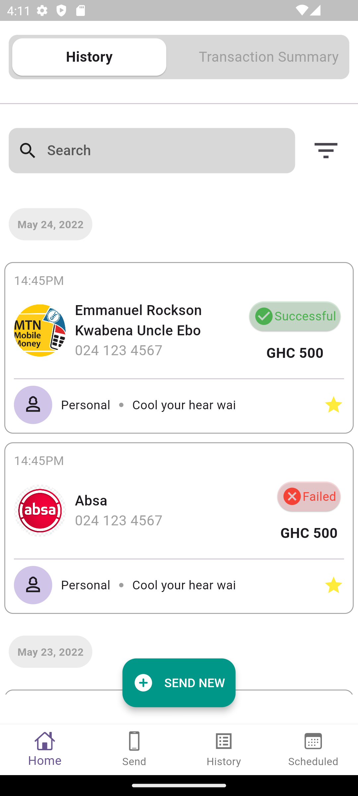
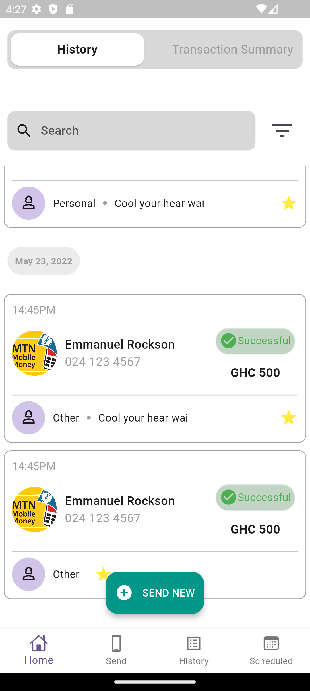

# Hubtel Coding Challenge

A new Flutter project.

## Getting Started

I started by first categorizing areas I could make into widgets and how I would do it.

I used the PageView widget to simulate exactly what was in the ui, by creating various items to match the ui.

Then moving on to the main page where I broke down to widgets and built each component separately before calling all of them in the home screen.

I wrote a unit test for the Card details widget to ensure it behaves as expected.

<table>
    <tr>
        <td></td>
        <td></td>
        <td></td>
    </tr>
</table>
